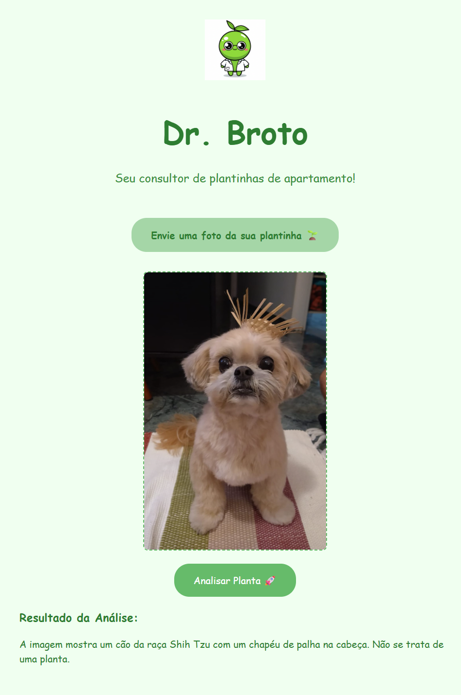

# 🌱 Dr. Broto

**Dr. Broto** is your friendly apartment plant consultant! Upload a photo of your plant and get instant analysis, care tips, and disease detection powered by AI.


---

## 🏗️ Project Structure

```
dr-broto/
│
├── backend/      # Node.js Express API (image analysis, AI integration)
├── front/        # React + TypeScript + Vite frontend
├── public/       # Static assets
├── .vs/          # Visual Studio workspace files
├── package.json  # Root scripts (dev, etc.)
└── README.md     # You are here!
```

---

## 🚀 Getting Started

### Prerequisites

- Node.js (v18+ recommended)
- npm

### 1. Clone the repository

```sh
git clone https://github.com/your-username/dr-broto.git
cd dr-broto
```

### 2. Install dependencies

```sh
npm install && npm install --prefix backend && npm install --prefix front
```

### 3. Configure Environment Variables

- **Backend:**  
  Create `backend/.env` and add your [Google Gemini API key](https://ai.google.dev/):

  ```
  GEMINI_API_KEY=your_google_gemini_api_key
  ```

- **Frontend:**  
  Already set to use the local backend in [`front/.env`](front/.env):

  ```
  VITE_API_URL=http://localhost:3001
  ```

### 4. Run the app (Dev Mode)

From the project root:

```sh
npm run dev
```

- Frontend: [http://localhost:5173](http://localhost:5173)
- Backend: [http://localhost:3001](http://localhost:3001)

---

## 🖼️ Features

- Upload a photo of your plant 🌿
- AI-powered plant identification and care tips
- Disease and deficiency detection
- Friendly, responsive UI

---

## 🛠️ Tech Stack

- **Frontend:** React 19, TypeScript, Vite, [react-markdown](https://github.com/remarkjs/react-markdown)
- **Backend:** Node.js, Express, Multer, [@google/genai](https://www.npmjs.com/package/@google/genai)
- **AI:** Google Gemini API

---

## 🧑‍💻 Development

- Linting: ESLint with recommended and React rules ([eslint.config.js](eslint.config.js), [front/eslint.config.js](front/eslint.config.js))
- Type checking: TypeScript strict mode
- Hot reload: Vite

### Expanding ESLint Configuration

For type-aware lint rules, update your ESLint config as follows:

```js
export default tseslint.config({
  extends: [
    ...tseslint.configs.recommendedTypeChecked,
    // ...tseslint.configs.strictTypeChecked,
    // ...tseslint.configs.stylisticTypeChecked,
  ],
  languageOptions: {
    parserOptions: {
      project: ['./tsconfig.node.json', './tsconfig.app.json'],
      tsconfigRootDir: import.meta.dirname,
    },
  },
})
```

---

## 🤝 Contributing

Pull requests are welcome! For major changes, please open an issue first.

---

## 📄 License

MIT

---

## 📷 Screenshot



---

## 💡 Inspiration

Created for plant lovers who want to keep their apartment greenery healthy and happy!
