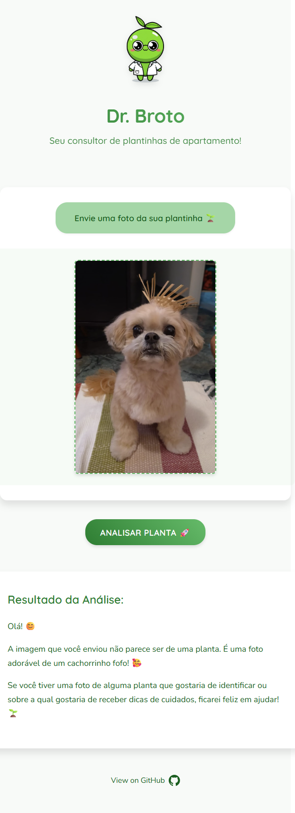

# 🌱 Dr. Broto

**Dr. Broto** is your friendly apartment plant consultant! Upload a photo of your plant and get instant analysis, care tips, and disease detection powered by AI.


---

## 🏗️ Project Structure

```
dr-broto/
│
├── backend/           # Node.js Express API (image analysis, AI integration)
│   ├── src/          # Source code
│   └── .env          # Environment variables
│
├── front/            # React + TypeScript + Vite frontend
│   ├── src/         # Source code
│   │   ├── assets/  # Static assets
│   │   ├── components/  # React components
│   │   └── services/   # API services
│   └── .env         # Environment variables
│
├── .vs/             # Visual Studio workspace files
├── package.json     # Root scripts (dev, etc.)
└── README.md        # You are here!
```

---

## 🚀 Getting Started

### Prerequisites

- Node.js (v18+ recommended)
- npm
- Google Gemini API key

### 1. Clone the repository

```sh
git clone https://github.com/henriquespecian/dr-broto.git
cd dr-broto
```

### 2. Install dependencies

```sh
npm install && npm install --prefix backend && npm install --prefix front
```

### 3. Configure Environment Variables

- **Backend:**  
  Create `backend/.env` and add your [Google Gemini API key](https://ai.google.dev/):

  ```
  GEMINI_API_KEY=your_google_gemini_api_key
  ```

- **Frontend:**  
  Already set to use the local backend in [`front/.env`](front/.env):

  ```
  VITE_API_URL=http://localhost:3001
  ```

### 4. Run the app (Dev Mode)

From the project root:

```sh
npm run dev
```

- Frontend: [http://localhost:5173](http://localhost:5173)
- Backend: [http://localhost:3001](http://localhost:3001)

---

## 🖼️ Features

- 📸 Upload photos of your plants
- 🤖 AI-powered plant identification
- 🌿 Detailed care instructions
- 🦠 Disease and deficiency detection
- 💧 Watering and sunlight recommendations
- 📱 Responsive, user-friendly interface
- 🎨 Modern, clean design with animations

---

## 🛠️ Tech Stack

### Frontend
- React 19
- TypeScript
- Vite
- CSS3 with modern features
- react-markdown for formatted responses
- Custom hooks and services

### Backend
- Node.js
- Express
- Multer for file uploads
- @google/genai for AI integration
- Environment-based configuration

### AI & Integration
- Google Gemini API
- Custom prompt engineering
- Image analysis capabilities

---

## 🧑‍💻 Development

### Code Quality
- ESLint with recommended and React rules
- TypeScript strict mode
- Prettier for code formatting
- Hot reload with Vite

### Project Organization
- Component-based architecture
- Service layer for API communication
- Asset management
- Environment configuration

### Expanding ESLint Configuration

For type-aware lint rules, update your ESLint config as follows:

```js
export default tseslint.config({
  extends: [
    ...tseslint.configs.recommendedTypeChecked,
    // ...tseslint.configs.strictTypeChecked,
    // ...tseslint.configs.stylisticTypeChecked,
  ],
  languageOptions: {
    parserOptions: {
      project: ['./tsconfig.node.json', './tsconfig.app.json'],
      tsconfigRootDir: import.meta.dirname,
    },
  },
})
```

---

## 🤝 Contributing

1. Fork the repository
2. Create your feature branch (`git checkout -b feature/amazing-feature`)
3. Commit your changes (`git commit -m 'feat: add amazing feature'`)
4. Push to the branch (`git push origin feature/amazing-feature`)
5. Open a Pull Request

For major changes, please open an issue first to discuss what you would like to change.

---

## 📄 License

This project is licensed under the MIT License - see the [LICENSE](LICENSE) file for details.

---

## 📷 Screenshots



---

## 💡 Inspiration

Created for plant lovers who want to keep their apartment greenery healthy and happy! Dr. Broto combines the power of AI with a friendly interface to make plant care accessible to everyone.

---

## 🔗 Links

- [GitHub Repository](https://github.com/henriquespecian/dr-broto)
- [Google Gemini API](https://ai.google.dev/)
